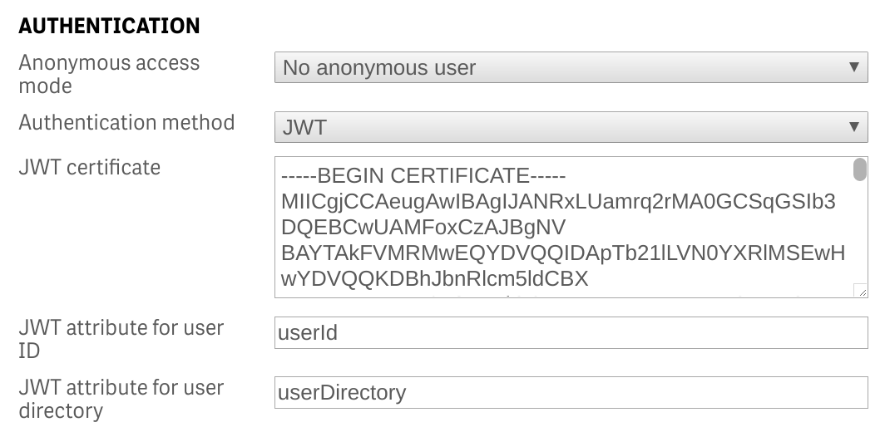

# qlik-sense-jwt-python
Simple python example demonstrating JSON Web Tokens (JWT) authentication with Qlik Sense

## QMC Configuration

1. Create a new Virtual Proxy

2. Set the Authentication to JWT

### Note: The JWT certificate is the public certificate in PEM format
3. Set the Load Balancing nodes

4. Link the Virtual Proxy to a Proxy

## Certificates
Either use the dummy certificates included (for testing only) or create new certificates.
The certificates in the ./certs folder were created using openssh:

- openssl genrsa -out private.key 1024
- openssl req -new -x509 -key private.key -out public.key

## Code
Set the variables correctly for your Qlik Sense Server.

### Qlik Sense variables
1. senseHost = 'qmi-qs-clbin/pythonn'
2. proxyPrefix = 'jwt'
3. userDirectory = 'jwtSense'
4. userName = 'testJWT'

### jwt data to send
The JWT token will comprise of the username of the user and the user directory.  This is defined in jwtData

## Result
Note the response back from /qrs/about is correct

The user is added to the QMC

